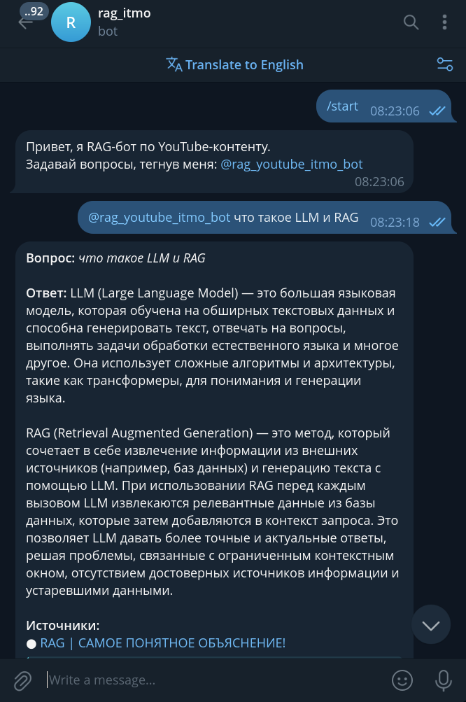
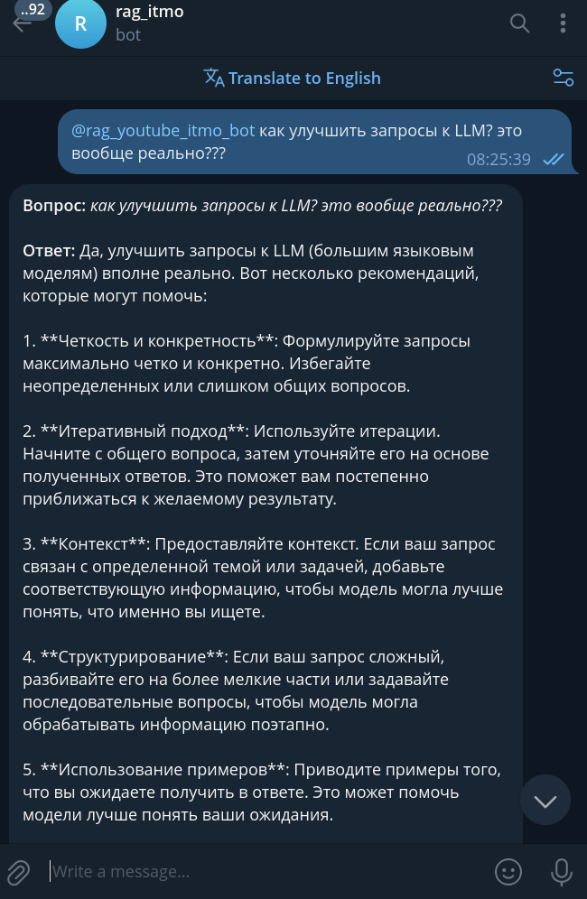

# RAG YouTube Bot (ИТМО, LLM)

Проект Retrieval-Augmented Generation (RAG) для ответов на вопросы по YouTube-видео с тематикой Machine Learning.
 Разработан в рамках проектной деятельности ИТМО по курсу **Введение в LLM**

Бот индексирует транскрипты YouTube-видео, извлекает релевантные фрагменты и формирует ответы с опорой на источники.

------

## Состав команды

- Ибрашов Джамал Ербулатович
- Шишкин Павел Егорович

------

## Архитектура и подход

- **RAG-подход**: Retrieval + Generation
- **Retrieval**: LlamaIndex + векторное хранилище
- **Embeddings**: OpenAI (через кастомный proxy)
- **LLM**: GPT-4o-mini
- **Интерфейс**: Telegram Bot (aiogram)
- **Контроль релевантности**: дополнительный LLM-шаг (context judge)
- **Источники**: YouTube-видео (транскрипты)

Пайплайн:

1. Скачивание и транскрибация видео
2. Индексация чанков в векторное хранилище
3. Поиск top-K релевантных фрагментов
4. LLM-проверка достаточности контекста
5. Генерация ответа + ссылки на источники

------

## Метрики качества RAG

| Метрика     | Значение |
| ----------- | -------- |
| Precision@3 | 0.94     |
| Recall@3    | 0.92     |
| MRR         | 0.88     |

Метрики рассчитываются на контрольном наборе вопросов к видео.

------

## Используемые видео

Ввиду ограничений по кредитам `OPENAI_API_KEY` были выбраны **короткие видео (до 10 минут)** по тематике ML:

- https://www.youtube.com/watch?v=22tkx79icy4
- https://www.youtube.com/watch?v=bNQbxHxh5J8
- https://www.youtube.com/watch?v=8SxmzDSJymA
- https://www.youtube.com/watch?v=WIttZGQEdas
- https://www.youtube.com/watch?v=bI-gRcMgWvc

Список видео хранится в `data/my_videos.txt`.

------

## Структура проекта

```
.
├── app/                    # Telegram-бот и core-логика
│   ├── app.py              # Точка входа бота
│   ├── custom_embedding.py # Proxy для OpenAI embeddings
│   ├── utils.py
│   └── logs/
├── data/                   # Данные и индексы
│   ├── audio/              # Аудиофайлы видео
│   ├── index_storage_1024/ # Векторное хранилище LlamaIndex
│   ├── my_videos.txt       # Список YouTube-ссылок
│   └── video_info.json
├── data_pipelines/         # Пайплайны сбора данных
│   ├── parser_transcribe.py
│   └── index_pipeline.py
├── Makefile
├── README.md
├── requirements.txt
├── pyproject.toml
└── poetry.lock
```

------

## Сбор данных и индексация

Индексация выполняется командой:

```
python -m data_pipelines.index_pipeline
```

Особенности:

- обрабатываются **только видео** из `data/my_videos.txt`
- автоматически:
  - скачивается аудио
  - выполняется транскрибация
  - создаются чанки
  - строится векторный индекс (`data/index_storage_1024`)

------

## Установка и запуск

### 1. Подготовка окружения

```
deactivate
rm -rf .venv || true
python3.11 -m venv .venv
source .venv/bin/activate
```

### 2. Установка зависимостей

```
make requirements
```

### 3. Переменные окружения

Создайте `.env` файл или экспортируйте переменные:

```
OPENAI_API_KEY=...
TG_TOKEN=...
BOT_ID=...
```

Дополнительно (опционально):

```
PROXY=http://...
```

------

### 4. Запуск бота

```
make run-bot
```

После запуска бот доступен в Telegram и отвечает на вопросы при упоминании.

------

## Пример работы (демо)

<table>
  <tr>
    <td>
      
    </td>
    <td>
      
    </td>
    <td>
      
    </td>
  </tr>
</table>


------

## Ключевые особенности реализации

- Асинхронная обработка сообщений и очередей
- Rate-limit friendly поведение (typing + задержки)
- Явный отказ от ответа при отсутствии релевантного контекста
- Прозрачные источники (ссылки на видео)
- Логирование в файл и stdout

------

## Технологический стек

- Python 3.11
- OpenAI API
- LlamaIndex
- aiogram
- YouTube transcripts
- Telegram Bot API

------

## Статус проекта

Проект находится в стадии **учебного прототипа**, ориентированного на:

- исследование RAG-подходов
- оценку качества retrieval
- архитектурные эксперименты с LLM-агентами
