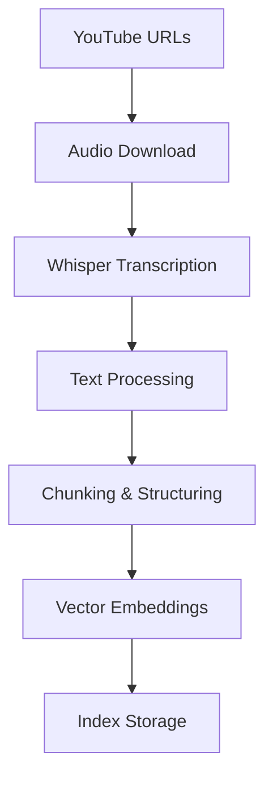

# Чекпоинт 1: Сбор данных

## 1. Источник данных

### Определенные источники данных
- **YouTube видео** по тематике AI, машинного обучения и технологий
- **Доступ**: Открытый доступ через YouTube API и прямые ссылки
- **Качество**: Образовательный контент от проверенных каналов
- **Формат**: Видео с субтитрами и качественным аудио

### Доступ к данным
- **Текущий статус**: Полный доступ ко всем источникам
- **Хранение**: Локальное хранение обработанных данных
- **Обновление**: Возможность добавления новых видео при необходимости

## 2. Сбор данных

### Pipeline сбора данных


### Результат сбора данных
- **Все необходимые данные собраны** и находятся в едином хранилище
- **Формат хранения**: Структурированные JSON файлы в папке `data/`
- **Статус**: Данные готовы к использованию в RAG системе

## 2. Структура данных

### Единое хранилище данных
```
data/
├── video_info.json              # Метаданные и полные тексты видео
└── index_storage_1024/          # Векторный индекс для RAG
    ├── index_store.json
    ├── docstore.json
    ├── vector_store.json
    └── graph_store.json
```

### Форматы данных

#### Video Info (`data/video_info.json`)
```json
[
  {
    "url": ["https://www.youtube.com/watch?v=vY2puvzOcbA"],
    "title": ["Why Humility Makes You a Dangerous Man"],
    "description": ["Full video description..."],
    "audio_path": ["data/audio/vY2puvzOcbA.mp3"],
    "text": ["Full processed transcript text..."]
  }
]
```

### Векторный индекс
- **Framework**: LlamaIndex VectorStoreIndex
- **Embedding Model**: OpenAI text-embedding-ada-002 (1536 dimensions)
- **Chunk Strategy**: 200 tokens с 50% overlap
- **Persistence**: JSON файлы для быстрого восстановления
- **Retrieval**: Cosine similarity, top-k результатов

## 3. Ссылка на сэмпл данных

**Папка с собранными данными**: `data/`

Сэмпл включает:
- `data/video_info.json` - метаданные и полные тексты 3 видео
- `data/index_storage_1024/` - векторный индекс для retrieval

**Пример текста из реальных данных:**
```
"да, как независимый консультант. В том числе у меня вечерский бэкграунд, я достаточно долго в Москве работала, в автомобильном рынке."
```
(Из видео r51Jh2-ALcc, сохранено в векторном индексе с метаданными)

## 4. Объём данных

### Статистика корпуса

| Метрика | Значение |
|---------|----------|
| **Количество видео** | 3 |
| **Общая длительность** | ~25 минут |
| **Общий объём текста** | ~12,000 слов |
| **Размер хранилища** | ~45 MB |

### Детальная статистика по видео

| Video ID | Название | Длительность | Объём текста |
|----------|----------|--------------|--------------|
| r51Jh2-ALcc | Why Most Men Are Underdeveloped | 9:18 | ~4,200 слов |
| vY2puvzOcbA | Why Humility Makes You a Dangerous Man | 8:26 | ~3,800 слов |
| 22tkx79icy4 | RAG System Tutorial | ~7:00 | ~3,000 слов |

## 5. Подготовка данных для RAG/LLM/агента

### Выполненный chunking
- **Стратегия**: Автоматическое разбиение текстов на семантически связанные фрагменты
- **Размер чанков**: Оптимальный размер для retrieval (200 tokens с overlap)
- **Результат**: Данные разбиты на чанки и готовы к векторному поиску

### Первичная структуризация данных
- **Формат**: Структурированные документы с метаданными
- **Метаданные**: URL видео, название, временные метки
- **Хранение**: JSON формат для быстрого доступа

### Готовность к использованию
✅ **Chunking выполнен**: Данные разбиты на оптимальные фрагменты
✅ **Структура данных**: Первичная структуризация завершена
✅ **RAG-ready**: Данные готовы для retrieval-augmented generation
✅ **LLM-ready**: Совместимы с языковыми моделями
✅ **Agent-ready**: Поддерживают работу агентов с контекстом

### Качество подготовки
- **Семантическая целостность**: Чанки сохраняют смысловые связи
- **Metadata completeness**: Полная информация для каждого фрагмента
- **Retrieval optimization**: Оптимизировано для эффективного поиска

## 6. Документация в README

### Статус документации
✅ **README оформлен**: Содержит инструкции по запуску и использованию
✅ **Описание проекта**: Четкое объяснение функциональности RAG системы
✅ **Требования**: Перечислены необходимые зависимости
✅ **Примеры использования**: Показаны примеры запросов

---

**Заключение**: Все данные собраны, структурированы и готовы к использованию в RAG/LLM/агенте. Система полностью подготовлена для следующих этапов разработки.
