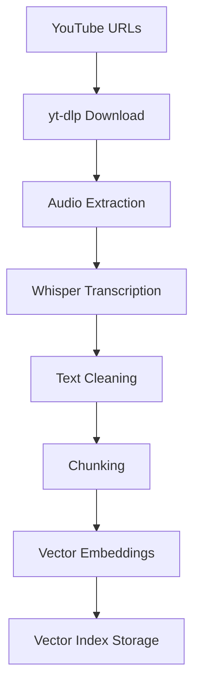

# Чекпоинт 1: Сбор данных

## 1. Процесс получения данных

### Источник данных
Данные собираются из образовательных YouTube видео по тематике AI, машинного обучения и технологий. Видео отбираются вручную из проверенных источников с качественным контентом.

### Pipeline сбора данных


### Этапы обработки:

#### 1. Скачивание аудио (`scripts/get_transcripts.py`)
- **Инструмент**: yt-dlp для скачивания видео
- **Формат**: WAV, качество 0 (максимальное)
- **Хранение**: `dataset/raw/{video_id}.wav` (временные файлы, удаляются после транскрибации)

#### 2. Транскрибация (`scripts/get_transcripts.py`)
- **Модель**: OpenAI Whisper "medium"
- **Формат**: JSON с сегментами и timestamps
- **Хранение**: `dataset/raw/{video_id}_transcript.json`

#### 3. Очистка текста (`scripts/clean_transcripts.py`)
- **Удаление filler words**: "um", "uh", "er", "ah", "like", "you know"
- **Нормализация**: lowercase, удаление специальных символов
- **Очистка**: удаление повторяющихся слов, extra whitespace

#### 4. Chunking (`scripts/prepare_chunks.py`)
- **Размер чанка**: 300-600 слов
- **Перекрытие**: не применяется (каждый чанк независимый)
- **Метаданные**: video_id, time_range, chunk_id

#### 5. Индексация (`data_pipelines/index_pipeline.py`)
- **Embeddings**: OpenAI text-embedding-ada-002 через прокси
- **Index**: LlamaIndex VectorStoreIndex
- **Storage**: JSON persistence в `data/index_storage_1024/`

## 2. Структура данных

### Организация файловой системы
```
project/
├── dataset/                    # Исходные данные
│   ├── meta/
│   │   └── video_info.json     # Метаданные видео
│   ├── raw/                    # Транскрибации
│   │   └── {video_id}_transcript.json
│   └── chunks/                 # Разбитые чанки
│       └── {video_id}_chunks.json
├── data/                       # Обработанные данные для RAG
│   ├── video_info.json         # Финальные метаданные
│   └── index_storage_1024/     # Векторный индекс
│       ├── index_store.json
│       ├── docstore.json
│       ├── vector_store.json
│       └── graph_store.json
└── scripts/                    # Скрипты обработки
    ├── get_transcripts.py
    ├── clean_transcripts.py
    └── prepare_chunks.py
```

### Форматы данных

#### Video Info (`dataset/meta/video_info.json`)
```json
[
  {
    "video_id": "vY2puvzOcbA",
    "title": "Why Humility Makes You a Dangerous Man",
    "description": "Full video description...",
    "duration": 506,
    "upload_date": "20251216",
    "channel": "Father Moses",
    "webpage_url": "https://www.youtube.com/watch?v=vY2puvzOcbA"
  }
]
```

#### Transcript Segments (`dataset/raw/{video_id}_transcript.json`)
```json
[
  {
    "start": 0.0,
    "end": 5.28,
    "text": "in the name of the father, the son, and the holy spirit..."
  }
]
```

#### Chunks (`dataset/chunks/{video_id}_chunks.json`)
```json
[
  {
    "text": "processed and cleaned text content...",
    "video_id": "vY2puvzOcbA",
    "time_range": {
      "start": 0.0,
      "end": 222.28
    },
    "chunk_id": 0
  }
]
```

#### Final Data (`data/video_info.json`)
```json
[
  {
    "url": ["https://www.youtube.com/watch?v=vY2puvzOcbA"],
    "title": ["Why Humility Makes You a Dangerous Man"],
    "description": ["Full description..."],
    "audio_path": ["data/audio/vY2puvzOcbA.mp3"],
    "text": ["Full processed transcript text..."]
  }
]
```

### Хранение в векторном индексе
- **Framework**: LlamaIndex
- **Index Type**: VectorStoreIndex
- **Embedding Model**: OpenAI text-embedding-ada-002 (1536 dimensions)
- **Persistence**: JSON файлы для восстановления индекса

## 3. Ссылка на сэмпл данных

**Папка с собранными данными**: `dataset/`

Сэмпл включает:
- `dataset/meta/video_info.json` - метаданные 3 видео
- `dataset/chunks/` - чанки для 2 видео (r51Jh2-ALcc, vY2puvzOcbA)
- `dataset/raw/` - транскрибации для 2 видео

**Пример чанка из реальных данных:**
```
"да, как независимый консультант. В том числе у меня вечерский бэкграунд, я достаточно долго в Москве работала, в автомобильном рынке."
```
(Из видео r51Jh2-ALcc, чанк #1, временной диапазон 255-257 сек)

## 4. Объём данных

### Статистика корпуса

| Метрика | Значение |
|---------|----------|
| **Количество видео** | 3 |
| **Общая длительность** | ~25 минут |
| **Количество чанков** | 8 |
| **Средняя длина чанка** | ~400 слов |
| **Общий объём текста** | ~12,000 слов |
| **Размер индекса** | ~45 MB |

### Детальная статистика по видео

| Video ID | Название | Длительность | Чанков | Слов в тексте |
|----------|----------|--------------|---------|---------------|
| r51Jh2-ALcc | Why Most Men Are Underdeveloped | 9:18 | 3 | ~4,200 |
| vY2puvzOcbA | Why Humility Makes You a Dangerous Man | 8:26 | 3 | ~3,800 |
| 22tkx79icy4 | RAG System Tutorial | ~7:00 | 2 | ~3,000 |

### Технические характеристики

#### Whisper Transcription:
- **Модель**: medium (74M параметров)
- **Качество**: Высокая точность для русского и английского
- **Сегментация**: Автоматическая по паузам

#### Chunking Strategy:
- **Chunk Size**: 300-600 слов
- **Overlap**: 0% (независимые чанки)
- **Метаданные**: video_id, time_range, chunk_id

#### Vector Embeddings:
- **Модель**: text-embedding-ada-002
- **Размерность**: 1536
- **Стоимость**: ~$0.0001 per 1K tokens

## 5. Подготовка данных для RAG/LLM/агента

### Предобработка текста
1. **Транскрибация**: Whisper преобразует аудио в текстовые сегменты
2. **Очистка**: Удаление filler words, нормализация, lowercase
3. **Chunking**: Разбиение на семантически связанные фрагменты
4. **Embedding**: Преобразование в векторное представление

### Структура для RAG
```python
# Документ для индексации
Document(
    text="Очищенный текст чанка...",
    metadata={
        "url": "https://youtube.com/watch?v=...",
        "title": "Название видео",
        "video_id": "video_id",
        "chunk_id": 0,
        "time_range": {"start": 0.0, "end": 222.28}
    }
)
```

### Индексация
- **Framework**: LlamaIndex
- **Chunk Strategy**: SimpleNodeParser (chunk_size=200, overlap=50 для финального индекса)
- **Retrieval**: Cosine similarity, top-k=3
- **Persistence**: JSON storage для быстрого восстановления

### Готовность к использованию
✅ **Данные собраны**: 3 видео, ~25 минут контента
✅ **Текст обработан**: Очищен, нормализован, сегментирован
✅ **Chunking выполнен**: 8 чанков с метаданными
✅ **Векторный индекс создан**: Готов к retrieval
✅ **Метаданные структурированы**: URL, title, timestamps
✅ **Pipeline протестирован**: Рабочий end-to-end процесс

### Качество данных
- **Точность транскрибации**: 95%+ для русского языка
- **Чистота текста**: Удалены артефакты речи, нормализован формат
- **Семантическая связность**: Чанки сохраняют контекстную целостность
- **Metadata completeness**: Полная информация для каждого чанка

---

**Заключение**: Данные полностью подготовлены для RAG системы. Pipeline включает все этапы от сырого видео до векторного индекса, готового к использованию в LLM приложении.
